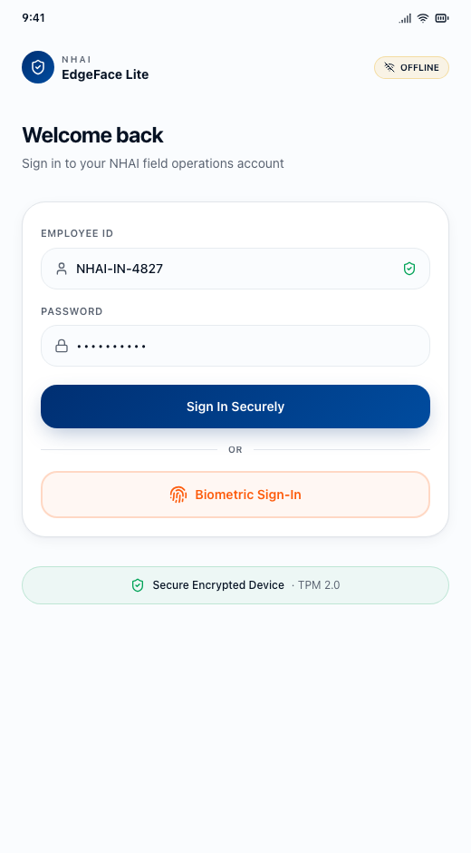
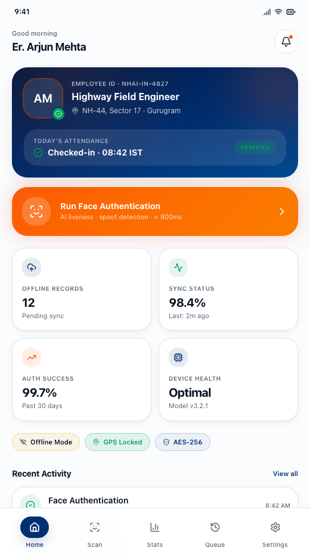
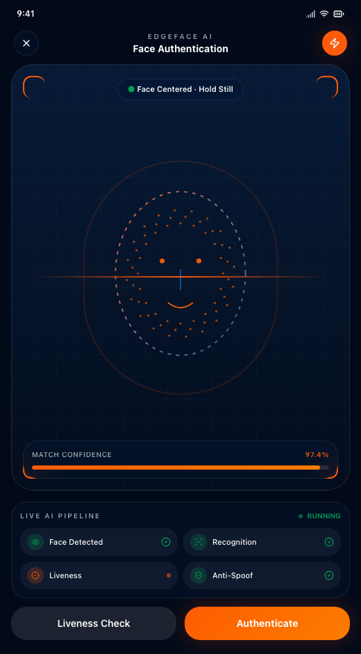
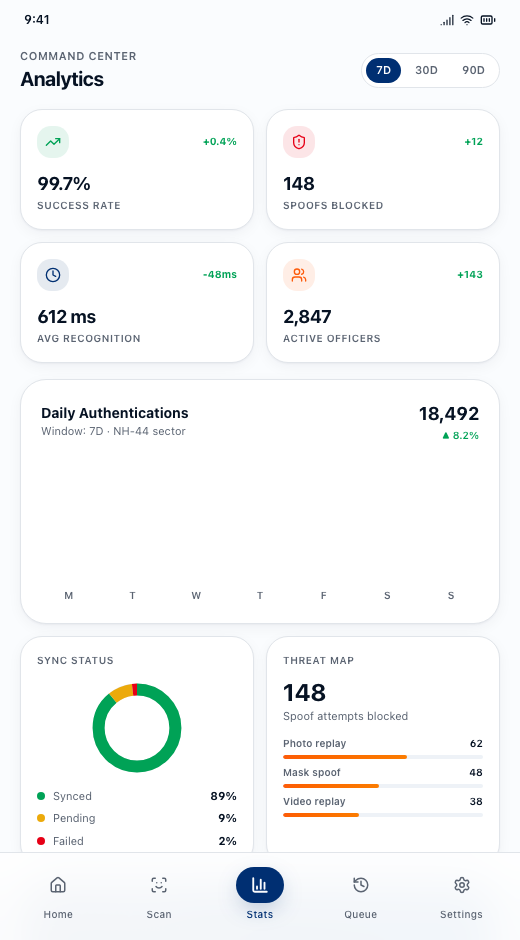

# EdgeFace Lite

EdgeFace Lite is a cross-platform field attendance and identity verification system built for NHAI-style highway operations. The project combines a polished mobile-first web/Capacitor interface with an Expo React Native implementation for installable Android and iOS builds.

The app focuses on secure field officer check-ins using face authentication, liveness verification, GPS context, offline-first attendance storage, and sync-ready queue management for low-connectivity highway environments.

## Screenshots

| Secure Login | Officer Dashboard |
| --- | --- |
|  |  |

| Face Authentication | Command Analytics |
| --- | --- |
|  |  |

## Problem Statement

Field attendance systems often fail in remote or high-mobility environments because they depend on stable connectivity, weak manual verification, or centralized biometric checks. EdgeFace Lite addresses this by allowing a field officer to authenticate on-device, preserve signed attendance records offline, and sync securely when connectivity returns.

## Core Features

- Face authentication workflow with liveness and anti-spoofing UI
- Offline-first attendance queue for low-network field conditions
- GPS-aware attendance capture and location trust context
- Secure officer session handling and device biometric unlock
- SHA-512 record digest generation in the Expo mobile app
- Encrypted local storage boundaries through SecureStore in mobile builds
- Queue retry states for pending, synced, and failed records
- Analytics dashboard for success rate, spoof attempts, recognition latency, and active officers
- Security center surfaces for encryption, model integrity, and device trust
- Expo Go preview support plus EAS installable Android/iOS build support
- Capacitor iOS shell for the mobile web implementation

## Architecture

```text
EdgeFace Lite
├── src/                    # Mobile-first web app routes and UI
│   ├── routes/             # Login, home, scan, liveness, analytics, queue, settings
│   ├── components/         # Phone shell, navigation, status bar, shared UI
│   └── styles.css          # App styling and responsive mobile interface
├── mobile-expo/            # Expo React Native implementation
│   ├── App.tsx             # Native app flow and screen router
│   ├── src/services/       # Session, API, queue, native, audit, settings services
│   ├── app.json            # App name, identifiers, permissions, native plugins
│   └── eas.json            # EAS build profiles for installable builds
├── ios/                    # Capacitor iOS project
├── docs/screenshots/       # README screenshots captured from the running app
└── capacitor.config.ts     # Capacitor app configuration
```

## Tech Stack

| Layer | Technologies |
| --- | --- |
| Web app | React, TypeScript, Vite, TanStack Router |
| Mobile shell | Capacitor iOS |
| Native mobile | Expo, React Native, TypeScript |
| Native capabilities | Expo Camera, Location, SecureStore, Crypto, Local Authentication, Notifications |
| UI | Tailwind CSS, Radix UI primitives, Lucide icons |
| Builds | Expo Go for preview, EAS Build for installable Android/iOS apps |

## App Flows

1. Officer signs in using employee credentials or biometric entry.
2. Dashboard shows attendance state, device health, offline records, and sync status.
3. Officer starts face authentication.
4. Liveness and anti-spoof checks validate the capture.
5. Attendance record is signed with GPS/device context.
6. Record is stored locally when offline.
7. Queue sync uploads records when the production API is available.
8. Analytics and security screens provide operational visibility.

## Local Web Setup

```sh
npm install
npm run dev
```

Open the local URL printed by Vite, usually:

```text
http://localhost:8080
```

If the port is busy, Vite will automatically choose the next available port.

## Expo Mobile Setup

```sh
cd mobile-expo
npm install
npm run typecheck
npm run start
```

Scan the QR code with Expo Go for development preview. Expo Go previews the app inside the Expo Go container; it does not install a separate app icon.

## Installable Android Build

```sh
cd mobile-expo
npx eas login
npm run build:android:preview
```

EAS will create an Android APK and provide an install link/QR code. Opening that link on an Android phone installs EdgeFace Lite as a real app.

## Installable iOS Build

```sh
cd mobile-expo
npx eas login
npm run build:ios:preview
```

iOS builds require Apple signing. Use an Apple Developer account with ad hoc/internal device registration, TestFlight, or App Store distribution.

## Production Configuration

Set the production API base URL before creating production builds:

```sh
EXPO_PUBLIC_API_BASE_URL=https://your-production-api.example
```

The mobile app expects these backend endpoints:

- `POST /auth/login`
- `POST /attendance/records`
- `POST /auth/logout`

## Available Scripts

Root project:

```sh
npm run dev          # Start web app
npm run build        # Build web app
npm run preview      # Preview production web build
npm run ios:sync     # Sync Capacitor iOS project
npm run ios:run      # Run Capacitor iOS app
```

Expo project:

```sh
cd mobile-expo
npm run start                  # Start Expo Go preview
npm run start:lan              # Start Expo Go on LAN
npm run start:tunnel           # Start Expo Go through tunnel
npm run typecheck              # TypeScript check
npm run build:android:preview  # Android APK install build
npm run build:ios:preview      # iOS internal build
```

## Current Implementation Status

Implemented:

- Web and Expo mobile app structures
- Login, home, scan, liveness, success, trust score, analytics, queue, security, and settings screens
- Native permission configuration for camera, location, biometrics, notifications, and secure storage
- Offline queue persistence and retry state handling
- Production API boundary for auth, attendance upload, and logout
- EAS Android/iOS build configuration

Requires production integration:

- Real NHAI authentication service
- Production attendance upload API
- Approved biometric or face-recognition/liveness model
- Datalake ingestion endpoint
- Apple Developer signing for iOS distribution

## Security Notes

EdgeFace Lite is designed with privacy-aware field operations in mind. The mobile implementation separates session storage, queue persistence, audit logging, and API communication into dedicated service boundaries. Production deployment should connect these boundaries to audited backend services, enforce key rotation, and validate any biometric model through an approved security review.

## Project Identity

| Field | Value |
| --- | --- |
| App name | EdgeFace Lite |
| Android package | `gov.nhai.edgefacelite` |
| iOS bundle ID | `gov.nhai.edgefacelite` |
| Expo slug | `edgeface-lite` |

